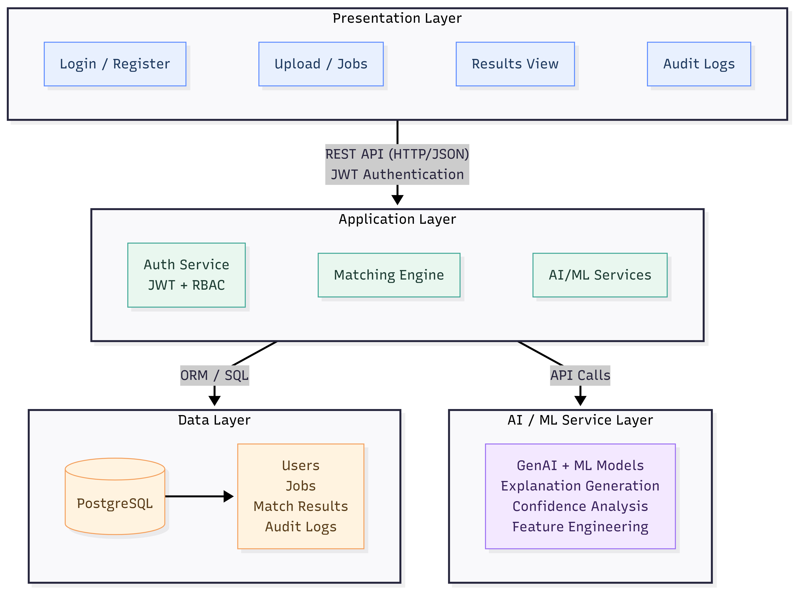

# Deterministic Data Reconciliation System

[](LICENSE)
[](https://github.com/Srivari-Hema-SSPL-2026/deterministic-data-reconciliation-system)
[](docs/diagrams/system-architecture.png)
[](https://www.python.org/)
[](https://www.typescriptlang.org/)
[](https://react.dev/)
[](https://flask.palletsprojects.com/)
[](https://www.postgresql.org/)
[](https://ai.google.dev/)
[](https://github.com/Srivari-Hema-SSPL-2026)

A deterministic data reconciliation system that accurately maps structured records using numeric-aware fuzzy matching, **with AI-assisted explainability and confidence analysis**. Built with an **N-Tier enterprise architecture** comprising **React.js**, **Flask REST API**, and **PostgreSQL**, with **JWT-based authentication and role-based access control**.

---

## 📑 Table of Contents

- [Abstract](#abstract)
- [Problem Statement](#problem-statement)
- [Key Features](#key-features)
- [System Architecture](#system-architecture)
- [Technology Stack](#technology-stack)
- [Repository Structure](#repository-structure)
- [Contributing](#contributing)
- [Organization](#organization)
- [About & Community](#about--community)
- [Attribution](#attribution)
- [License](#license)
- [Acknowledgements](#acknowledgements)

---

## 📌 Abstract

This project presents the design and implementation of a deterministic data reconciliation system that accurately maps structured records using numeric-aware fuzzy matching, **with AI-assisted explainability and confidence analysis**. The system addresses limitations of traditional fuzzy matching techniques that ignore numeric identifiers, leading to false positives in enterprise datasets. The solution combines deterministic algorithms with GenAI-powered explanations and ML-based confidence scoring to provide reliable, explainable, and auditable reconciliation results.

---

## 🎯 Problem Statement

In many enterprise environments, data reconciliation between heterogeneous sources relies on fuzzy string matching. However, traditional approaches such as token-based similarity suffer from several critical limitations:

- **Numeric identifiers are ignored or weakly weighted** - Leading to false positive matches in datasets with embedded numeric identifiers
- **High false-positive match rates** - Incorrect mappings in critical financial and operational datasets
- **Non-deterministic outcomes** - Same inputs produce different results, making results unreliable
- **Lack of explainability and auditability** - No clear reasoning for match decisions, unsuitable for compliance
- **Limited suitability for regulated environments** - Cannot meet compliance requirements for audit trails

This project addresses these challenges by providing a deterministic, numeric-aware fuzzy matching system with AI-assisted explainability and ML-based confidence analysis, designed specifically for enterprise data reconciliation with complete auditability.

---

## 🎯 Key Features

- ✨ **Deterministic Numeric-Aware Fuzzy Matching**
  - Numeric-aware matching with guaranteed consistency and repeatability
  - Text similarity scoring with RapidFuzz algorithms
  - Explicit numeric comparison enforcing consistency as core constraint
  - Configurable thresholds and scoring weights for different use cases
  - Deterministic tie-breaking for stable match selection

- 🧠 **AI-Assisted Explainability**
  - GenAI-generated natural language explanations for match decisions
  - Human-readable justifications for ACCEPT/REJECT outcomes
  - Context-aware explanations based on matching signals (text score, numeric score)
  - Integration with audit drill-down for enhanced understanding
  - Fixed prompt templates to prevent hallucination and maintain determinism

- 📊 **ML-Based Confidence Analysis**
  - Feature-based confidence classification (HIGH/MEDIUM/LOW)
  - Logistic Regression or Decision Tree models for explainable results
  - Deterministic inference with feature engineering (text score, numeric score, token overlap, length variance)
  - Confidence indicators displayed in results and audit views
  - Model performance monitoring and validation

- 🧱 **Enterprise-Grade N-Tier Architecture**
  - Presentation Layer: React.js with TypeScript, routing, and protected routes
  - Application Layer: Flask REST API with JWT authentication and RBAC
  - Data Layer: PostgreSQL/SQLite with SQLAlchemy ORM and proper relationships
  - AI/ML Service Layer: GenAI and ML models for explainability and confidence
  - Clear separation of concerns enabling scalability and maintainability

- 🔐 **Secure Authentication & Authorization**
  - JWT-based stateless authentication with token refresh support
  - Secure password hashing using Werkzeug security utilities
  - Protected API endpoints with role-based access control
  - Login/Register pages with proper validation and error handling
  - Production-ready security configuration with enforced validation

- 👥 **Role-Based Access Control (RBAC)**
  - Analyst Role: Create jobs, view results, access audit logs
  - Admin Role: Full system access including job execution and system metrics
  - Admin dashboard with system summary, audit log viewer, and user management
  - Route protection at both frontend (PrivateRoute, AdminRoute) and backend levels
  - Role-aware UI components and API endpoint restrictions

- 🗄️ **Comprehensive Data Persistence**
  - User accounts with secure credential storage
  - Job tracking with status, timestamps, and file metadata
  - Match results with scores, confidence levels, and match types
  - Complete audit trail for all matching decisions with detailed explanations
  - Foreign key relationships with cascade delete for data integrity

- 📜 **Explainable Audit Trail**
  - Detailed audit logs for every match decision
  - Text match scores, numeric consistency flags, and final scores
  - AI-generated explanations for human-readable justifications
  - ML confidence indicators for decision support
  - Chronological sorting and pagination support
  - Cross-user access prevention for security

- 📂 **Excel-Based Input/Output**
  - Direct Excel file input support (source and reference datasets)
  - Excel-based results export with matched codes and scores
  - Audit log export with detailed matching explanations
  - Batch processing capabilities for large datasets
  - Configurable column mappings for flexible data formats

---

## 🏗️ System Architecture

### Diagram



### ASCII

```text
┌─────────────────────────────────────────────────────────────────┐
│                    Presentation Layer                           │
│              React.js with TypeScript Frontend                  │
│  ┌──────────┐  ┌──────────┐  ┌──────────┐  ┌──────────┐         │
│  │  Login   │  │  Upload  │  │  Results │  │  Audit   │         │
│  │ Register │  │   Jobs   │  │  View    │  │  Logs    │         │
│  └──────────┘  └──────────┘  └──────────┘  └──────────┘         │
└───────────────────────┬─────────────────────────────────────────┘
                        │ REST API (HTTP/JSON)
                        │ JWT Authentication
                        ↓
┌─────────────────────────────────────────────────────────────────┐
│                    Application Layer                            │
│                      Flask REST API                             │
│  ┌──────────────┐  ┌──────────────┐  ┌──────────────┐           │
│  │ Auth Service │  │  Matching    │  │   AI/ML      │           │
│  │ JWT + RBAC   │  │  Engine      │  │  Services    │           │
│  └──────────────┘  └──────────────┘  └──────────────┘           │
└───────────┬──────────────────────────────┬──────────────────────┘
            │                              │
            │ ORM/SQL                      │ API Calls
            ↓                              ↓
┌───────────────────────┐    ┌──────────────────────────────────┐
│     Data Layer        │    │      AI/ML Service Layer         │
│   PostgreSQL          │    │   GenAI + ML Models              │
│                       │    │                                  │
│  • Users              │    │  • Explanation Generation        │
│  • Jobs               │    │  • Confidence Analysis           │
│  • Match Results      │    │  • Feature Engineering           │
│  • Audit Logs         │    │                                  │
└───────────────────────┘    └──────────────────────────────────┘
```

---

## 🧰 Technology Stack

### Console Application

- **Core Language:** Python 3.x
- **Data Processing:** Pandas, RapidFuzz
- **File I/O:** openpyxl (Excel support)
- **Logging:** Python logging module

### Web Application (Phase 2A)

- **Frontend:** React 19, Vite, React Router
- **Testing:** Vitest, React Testing Library
- **Styling:** CSS Modules
- **Build:** Vite for fast development and optimized production builds

### Backend (Phase 2B/2C)

- **API Framework:** Python Flask REST API
- **Database:** SQLite / PostgreSQL
- **Authentication:** Flask-JWT-Extended
- **ORM:** SQLAlchemy

### AI/ML Components (Planned)

- **GenAI:** Google Gemini API / OpenAI GPT (for explainability)
- **ML Framework:** scikit-learn (for confidence classification)
- **Feature Engineering:** Pandas, NumPy
- **Model Types:** Logistic Regression, Decision Tree, Random Forest

---

## 📂 Repository Structure

> **📋 Single Source of Truth**: The repository structure is maintained in [`docs/02_repository_structure.md`](docs/02_repository_structure.md).

**Quick Overview:**

```text
deterministic-data-reconciliation-system/
├── docs/                   # Documentation and reports
│   ├── 01_abstract.md
│   ├── 02_repository_structure.md
│   ├── diagrams/
│   ├── images/
│   └── reports/
├── src/                    # Application source (currently scaffolded)
│   ├── backend/
│   └── frontend/
├── pyproject.toml
└── README.md
```

For the complete repository structure with all file names and details, see: **[`docs/02_repository_structure.md`](docs/02_repository_structure.md)**

---

## 🤝 Contributing

Contributions are welcome and encouraged. You may contribute in the following ways:

- Bug fixes and corrections
- Documentation improvements
- Code quality enhancements
- Additional test coverage
- Feature implementations (following the architecture)
- Performance optimizations
- Security improvements

Please review [CONTRIBUTING.md](CONTRIBUTING.md) for detailed contribution guidelines, coding standards, and pull request process.

**Key Contribution Guidelines:**

- Follow the Zero-Copy Policy (all code must be original)
- Maintain N-Tier architecture separation
- Preserve deterministic matching core
- Add tests for new features
- Update documentation when making changes
- Follow existing code style and patterns

---

## 🏢 Organization

This project is part of the **[Srivari-Hema-SSPL-2026](https://github.com/Srivari-Hema-SSPL-2026)** GitHub organization, which hosts a collection of enterprise-grade software projects demonstrating modern development practices, AI integration, and N-Tier architecture patterns.

**Explore other projects:**

- Visit our [organization page](https://github.com/Srivari-Hema-SSPL-2026) to discover related repositories
- All projects follow consistent architectural principles and development standards
- Each project serves as an educational reference for specific technology domains

---

## 📞 About & Community

### [Swamy's Tech Skills Academy](https://www.linkedin.com/company/swamy-s-tech-skills-academy) & [ShyvnTech](https://www.linkedin.com/company/shyvntech)

This repository is stewarded and supported by **Swamy's Tech Skills Academy** and **ShyvnTech**. It demonstrates enterprise-grade software development practices and serves as an educational reference for deterministic algorithms, data reconciliation, and hybrid AI/ML integration patterns.

You can connect with the community to:

- Learn deterministic algorithm design
- Study data reconciliation techniques
- Explore AI/ML augmentation patterns
- Participate in knowledge-sharing discussions
- Access mentoring and training opportunities

---

## 📝 Attribution

All content in this repository is original and transformative. While inspired by various learning sources and best practices, the implementation, architecture, algorithms, and documentation are created from first principles to provide a unique educational experience.

---

## 📜 License

This project is licensed under the [MIT License](LICENSE). See the [LICENSE](LICENSE) file for details.

This project is intended for **academic and educational use**.

---

## 🙌 Acknowledgements

- **Pandas & RapidFuzz** - For data processing and fuzzy matching capabilities
- **Flask & React Communities** - For excellent open-source frameworks
- **PostgreSQL** - For robust database capabilities
- **Open Source Contributors** - For the tools and libraries that made this possible

---

> 🎓 **Deterministic Data Reconciliation System** — Designed and maintained by `Viswanatha Swamy P K`  
> Demonstrating deterministic algorithms with AI-assisted explainability and ML-based confidence analysis.  
> © 2026 Swamy's Tech Skills Academy, ShyvnTech & Srivari Software Solutions

**⭐ If you find this project useful, feel free to star the repository.**
